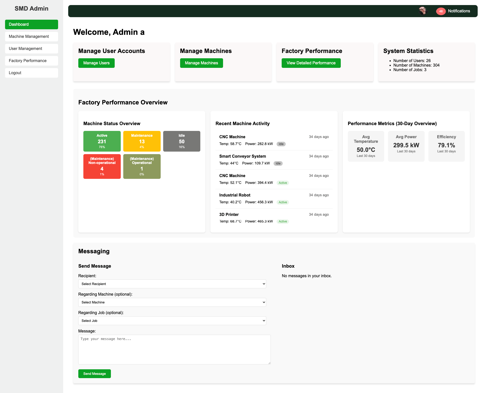

 <div align="center">
  <h1>Smart Manufacturing Dashboard (SMD) Project</h1>
  <p>Web-based Smart Manfacturing Dashboard</p>
</div>





## Table of Contents
- [Overview](#overview)
- [Features](#features)
- [Stacks Used](#stacks-used)
- [Installation and Setup](#installation-and-setup)
- [Usage](#usage)
- [License](#license)

## Overview
The Smart Manufacturing Dashboard (SMD) is a web-based platform designed to monitor and manage factory operations. This project aims to provide a user-friendly interface for various user roles(administrators, factory managers, auditors, and operators).

## Features
- **Holistic View:** Overall factory performance with key indicators and interactive design elements 
- **Alert System:** Notifications for critical events or anomalies
- **Messaging System:** Inter-user messaging with machine and job appending
- **Reporting:** PDF report generation 

## Stacks Used
- **Frontend:** HTML, CSS, JavaScript
- **Backend:** PHP, MySQL
- **Database:** Relational database with tables for users, machines, jobs, and factory logs

## Installation and Setup
1. Clone the repository:
   ```bash
   git clone https://github.com/gammaploid/Group13-UX2030/
   ```
2. Install dependencies:
   ```bash
   composer install
   ```
4. Set up the database:
   ```bash
   mysql -u root -p root < smd_database.sql
   ```


## Usage
1. **Set up a local server:**
   - For **Windows**, install and run **XAMPP**.
   - For **Mac**, install and run **MAMP**.
   - Lunch Apache webserver
   - Access via https://localhost:8888
   - register or access via exisiting credintials (admin username: a, password: a, manger username: m, password, a, auditor username: audit, password: 1, opreator username: opp, password: a)


## License 
MIT License

Copyright (c) 2023 Your Name

Permission is hereby granted, free of charge, to any person obtaining a copy of this software and associated documentation files (the "Software"), to deal in the Software without restriction, including without limitation the rights to use, copy, modify, merge, publish, distribute, sublicense, and/or sell copies of the Software, and to permit persons to whom the Software is furnished to do so, subject to the following conditions:
The above copyright notice and this permission notice shall be included in all copies or substantial portions of the Software.
