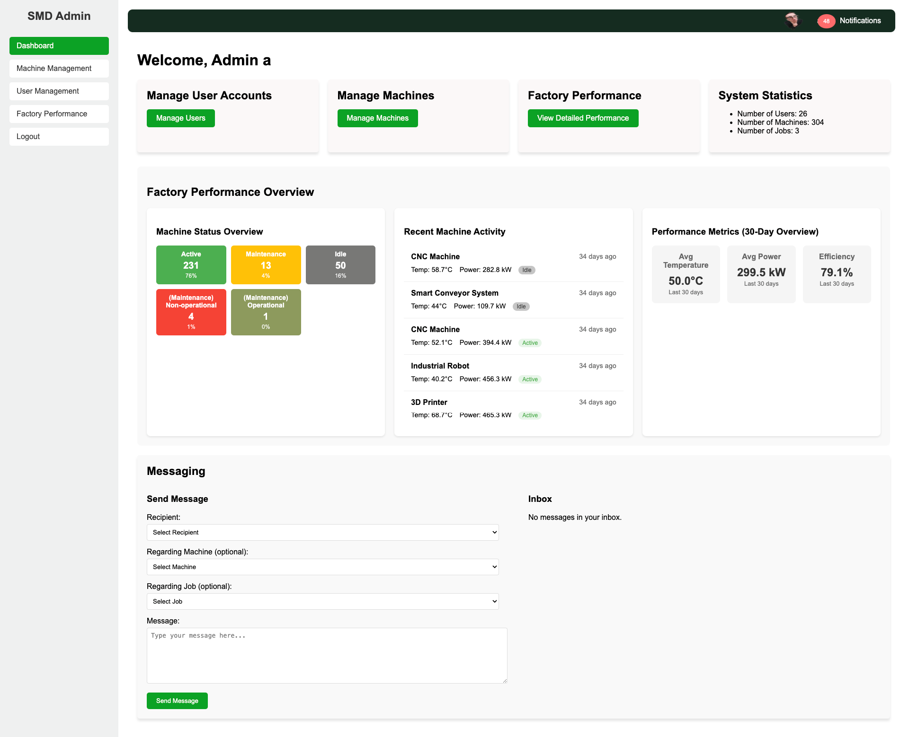

 

  <h1>Smart Manufacturing Dashboard (SMD) Project</h1>
  
Web-based Smart Manfacturing Dashboard

## Table of Contents
- [Overview](#overview)
- [Features](#features)
- [Stacks Used](#stacks-used)
- [Installation and Setup](#installation-and-setup)
- [Usage](#usage)
- [License](#license)

## Overview
The Smart Manufacturing Dashboard (SMD) is a web-based platform designed to monitor and manage factory operations. This project aims to provide a user-friendly interface for various user roles(administrators, factory managers, auditors, and operators).

## Features
- **Holistic View:** Overall factory performance with key indicators and interactive design elements 
- **Alert System:** Notifications for critical events or anomalies
- **Messaging System:** Inter-user messaging with machine and job appending
- **Reporting:** PDF report generation 

## Stacks Used
- **Frontend:** HTML, CSS, JavaScript
- **Backend:** PHP, MySQL
- **Database:** Relational database with tables for users, machines, jobs, and factory logs

